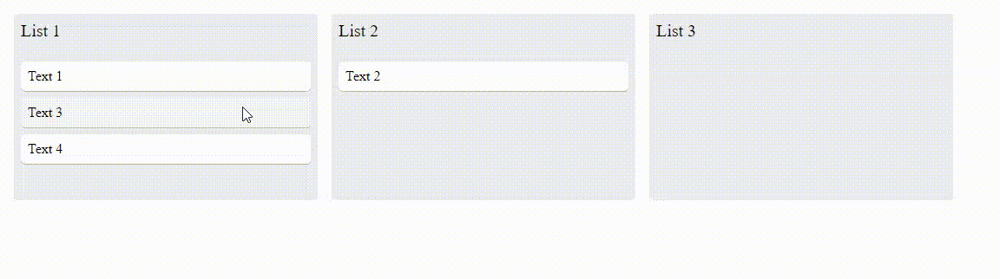

# Kanban Board React Only

This is a simple drag and drop feature without using any external libraries, only React and its [context api](https://pt-br.reactjs.org/docs/context.html) to fetch/save data

_Note: Any visual is just to display that it can be made, rather than to look good_

